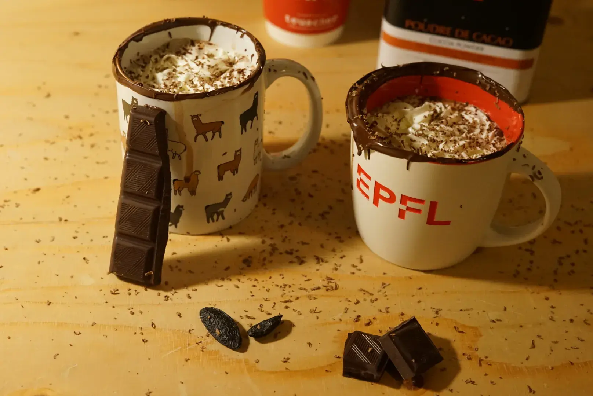

When I was at university, I made a lot of hot chocolate.
It was a way to meet new people ("Hey, we're making hot chocolate for 4, but we're three, wanna join?"), and to share some love, comfort, and happiness.

With my friend [Michael](https://michaelpaper.xyz), we even did this at scale by creating a [hot chocolate association](https://chocopoly.ch), that sometimes served 500 hot chocolates in one night.

I was surprised to see how bad people were at making hot chocolate, especially in switzerland, where hot chocolate is usually "mix a powder with milk and microwave".

There's so much more. I'll try here to share how I make and think about making hot chocolate most of the time.

# Ingredients for 4 mugs
- **1L of oat milk** (not sweetened, not flavored)
If you want a richer drink, you can replace 25cl of oat milk by vegetal cream. Soy, millet or almond are great.
- **100g of 60%+ dark chocolate** (note: the result will be different if it’s 50% or 80%, you may want to adapt the sugar)
- **1 big tablespoon of cocoa powder** (not a mix, pure cocoa)
- **3 tablespoons of something sweet** (scale to taste). Choose one from the following options:
  - brown sugar
  - sirop (chestnut, maple, mint, …)
  - caramel
  - chestnut spread
  - Sweet condensed oat milk (in this case, use 25cl and remove 25cl of milk)
- **Optional but great:**
  - Cinnamon
  - ⅓ of a tonka bean

> ## The original Albert
> Originaly, the Albert is using oat milk (50cl), soy cream (25cl), sweet condensed milk (25cl, form 50cl of oat milk and ~150g sugar), 70% dark chocolate and cocoa, cinnamon and tonka beans, a pinch of salt and a pinch of instant coffee. The topings were unsweetened vegan chantilly with graded dark chocolate.

# Instructions
1. In a saucepan, heat the oat milk with the sweetener of your choice over medium heat until it starts to steam. Do not let it boil.
2. Add the cocoa powder. If desired add cinnamon and grate the tonka beans.
3. Break the dark chocolate into small pieces and add them to the saucepan. It often help to not put it all at once.
4. Stir until the chocolate is completely melted and well combined with the milk.
5. You can let it simmer for a bit, it will make the hot chocolate more dense, but be careful that it does not boil.
6. Pour into mugs or cups and enjoy!

# Bonus for a great experience
## Chocolate cups
Just before serving, you can melt with a microwave a few squares of chocolate on a plate, and dip the top of your mugs in it. It’s fantastic.

Be careful when melting the chocolate, chocolate overcooks very fast, so the best is to put it for a very short time in the microwave (15~30s) stir a bit, and repeat if needed.

## Whipped cream
If you want a richer drink, whipped cream is always a nice addition. You’ll have a hard time finding a vegan one though, so you will likely need to make it. Most vegetable creams cannot be whipped, because they don’t have enough fat. In general any cream with less than 18% fat will not whisk well. Try to find some that are especially marketed as “whippable”, like this one.

Also remember the two ingredient of whipped cream are fat and cold. Make sure the cream is cold, the bowl too can be put in the fridge before being used. If it doesn’t seem to work, you can stop, but everything back into the fridge (or freezer) and continue afterwards.

If you add whipped cream to your hot chocolate, take the small extra effort to grate a bit of dark chocolate on top of it, it adds a great feeling.

Last tip, most commercial whipped cream is sweetened, but you don’t have to! If your drink is already very sweet, for instance because you used condensed milk, don’t add sugar to the whipped cream, it’ll balance nicely. On the other hand, if your drink is not sweet, maybe because you did not add any sweetener, then you can balance it with 1-2 tablespoon of sugar in the whipped cream. Of course you can also go all in or all out with sugar… that’s your preferences.

## Tastier?
If you want to make the flavour explode even more in your palate, you can add:
- A pinch of salt (not much, you don’t want your drink to be salty)
- A pinch of instant coffee (not much either)
- A bit of alcohol, for instance amaretto (a bit… or a lot!)

Those three are flavour enhancers which will make the taste richer. An other one is fat, but adding oil in your chocolate is unlikely to make you happy. Though it’s half of the reason why using cream makes the hot chocolate better (the other reason being the texture).

## Experiment!
Hot chocolate can be a personal evolving art. Adapt to the situation, your desires or those of your guests. You can add ginger, orange, use water and more chocolate instead of milk, you can not sweeten it or use different sugars. You can add spices, paprika, basil, mint, any syrup, berries, speculoos spread, matcha, thyme. You can make put it in your fridge for a cold chocolate and use cocoa butter for more fat. You can use pepper or mix it with alcohol or put much less milk and have it dense. You can make it more Italian with maizena or Colombian and add cheese in it. You can put juice or let it simmer for a long time, use carob instead of cocoa. You can put garlic or just replace the milk.

## Using a different milk
You can replace the oat milk by an other vegetable milk and you will get a different result. Here’s some of my opinion on the different milks:
- Oat milk is a great default. A lot of people don’t even realise it’s oat milk in the chocolate until you tell them. It’s nice.
- Almond and soy milk, are more risky. Some people love them, some hate them in the chocolate. Especially almond.
- Hazelnut is great, but also more expensive.
- Millet has a wonderful taste, but you’ll have a harder time finding it. You can make it though.
- I used multiple time a mix hazelnut-spelt-millet. A bit more expensive, but has a great taste.
- Don’t use milks that have vanilla or are sweetened. Is usually doesn’t tast great in hot chocolate. I expect some of them to be great though, but it might depend on the specific brand. Try at your own risk.
- Also, don’t use cow milk, obviously.
